<div align="center">

[🇬🇧 English](README.md) · [🇧🇷 Português](README.pt-BR.md) · **🇪🇸 Español**

<a href="https://natanaellima.blog">
  
</a>

<br>

<a href="https://natanaellima.blog"></a>
<a href="https://www.linkedin.com/in/natanaellima10/"></a>
<a href="mailto:natanaellima65@gmail.com"></a>


</div>

---

## `$ ls ~/proyectos --destacados`

<table>
<tr>
<td width="50%" valign="top">

### 🔍 [Google Dork Scanner v3](https://github.com/ademakin3051/ferramentagoogledorks)
Recon con Google Dorks directo desde la terminal. Base de dorks organizada por categoría, varios modos de operación e integración con API. Hecha para encontrar lo que quedó expuesto sin querer.

`Python` `OSINT` `Recon`

</td>
<td width="50%" valign="top">

### 🤖 [Bot GLPI + IA + WhatsApp](https://github.com/ademakin3051/botglpi)
Chatbot de soporte que abre y consulta tickets en GLPI por WhatsApp, resume el historial con GPT y deriva a un humano cuando hace falta. Service desk en piloto automático.

`n8n` `GLPI API` `OpenAI` `Evolution API`

</td>
</tr>
<tr>
<td width="50%" valign="top">

### 🌐 [natanaellima.blog](https://github.com/ademakin3051/portifolio)
Mi cuartel general en la web. Portafolio + blog con terminal animada, case studies y artículos. HTML, CSS y JS puros — cero frameworks, cero relleno.

`HTML` `CSS` `JavaScript`

</td>
<td width="50%" valign="top">

### ⌨️ [Digitador Automático](https://github.com/ademakin3051/digitador-automatico)
Simula escritura humana en cualquier editor. Interfaz en Tkinter, control del teclado con pynput. Parece que estoy programando en vivo — y no.

`Python` `Tkinter` `pynput`

</td>
</tr>
</table>

---

## `$ cat sobre_mi.txt`

```bash
┌──(natanael㉿kali)-[~]
└─$ ./perfil.sh

[+] nombre ...... Natanael Lima
[+] base ........ Portugal 🇵🇹  (made in Brasil 🇧🇷)
[+] enfoque ..... Red Team · Pentest · OSINT · Ingeniería Social
[+] también ..... Automatización (RPA) · Chatbots con IA · Soporte N1/N2
[+] estudiando .. Ciberseguridad @ Uninter
[+] idiomas ..... Portugués (nativo) · Español (B2) · Inglés (mejorando)

[*] Empecé en el hardware: abrí equipos, formateé, armé redes, uní PCs al dominio.
[*] Pasé por soporte N2: tickets, FortiClient, inventario, imagen corporativa.
[*] Hoy automatizo procesos con Python, n8n y Zapier y creo bots con IA.
[*] En mis ratos libres (y en los no tan libres): rompo cosas para entender cómo protegerlas.

[!] Abierto a oportunidades: Pentest · Red Team · Service Desk · Automatización
```

---

## `$ which arsenal`

**Ofensivo**

     

**Automatización & IA**

     

**Infra & Soporte**

     

---

## `$ nmap -sV natanael`

<div align="center">



</div>

---

<div align="center">


```
> conexión cerrada. vuelve cuando quieras. o no, igual me voy a enterar. 👁️
```

</div>
