<div align="center">

<a href="https://natanaellima.blog">
  
</a>

<br>

<a href="https://natanaellima.blog"></a>
<a href="https://www.linkedin.com/in/natanaellima10/"></a>
<a href="mailto:natanaellima65@gmail.com"></a>


</div>

---

## `$ ls ~/projetos --destaque`

<table>
<tr>
<td width="50%" valign="top">

### 🔍 [Google Dork Scanner v3](https://github.com/ademakin3051/ferramentagoogledorks)
Recon com Google Dorks direto do terminal. Base de dorks organizada por categoria, modos de operação e integração com API. Pra achar o que ficou exposto sem querer.

`Python` `OSINT` `Recon`

</td>
<td width="50%" valign="top">

### 🤖 [Bot GLPI + IA + WhatsApp](https://github.com/ademakin3051/botglpi)
Chatbot de suporte que abre e consulta chamados no GLPI pelo WhatsApp, resume o histórico com GPT e escala pra humano quando precisa. Service desk no piloto automático.

`n8n` `GLPI API` `OpenAI` `Evolution API`

</td>
</tr>
<tr>
<td width="50%" valign="top">

### 🌐 [natanaellima.blog](https://github.com/ademakin3051/portifolio)
Meu QG na web. Portfólio + blog com terminal animado, case studies e artigos. HTML, CSS e JS puros — zero framework, zero frescura.

`HTML` `CSS` `JavaScript`

</td>
<td width="50%" valign="top">

### ⌨️ [Digitador Automático](https://github.com/ademakin3051/digitador-automatico)
Simula digitação humana em qualquer editor. Interface em Tkinter, controle de teclado com pynput. Parece que tô codando ao vivo — e não tô.

`Python` `Tkinter` `pynput`

</td>
</tr>
</table>

---

## `$ cat sobre_mim.txt`

```bash
┌──(natanael㉿kali)-[~]
└─$ ./perfil.sh

[+] nome ........ Natanael Lima
[+] base ........ Portugal 🇵🇹  (made in Brasil 🇧🇷)
[+] foco ........ Red Team · Pentest · OSINT · Engenharia Social
[+] também ...... Automação (RPA) · Chatbots com IA · Suporte N1/N2
[+] estudando ... Cyber Segurança @ Uninter
[+] idiomas ..... Português (nativo) · Espanhol (B2) · Inglês (em upgrade)

[*] Vim do hardware: abri máquina, formatei, montei rede, botei PC em domínio.
[*] Passei pelo suporte N2: CSC, FortiClient, inventário, imagem corporativa.
[*] Hoje automatizo processos com Python, n8n e Zapier e monto bots com IA.
[*] Nas horas vagas (e nas não vagas): quebro coisa pra entender como protege.

[!] Aberto a oportunidades: Pentest · Red Team · Service Desk · Automação
```

---

## `$ which arsenal`

**Ofensivo**

     

**Automação & IA**

     

**Infra & Suporte**

     

---

## `$ nmap -sV natanael`

<div align="center">



</div>

---

<div align="center">


```
> conexão encerrada. volte sempre. ou não, eu vou saber de qualquer jeito. 👁️
```

</div>
